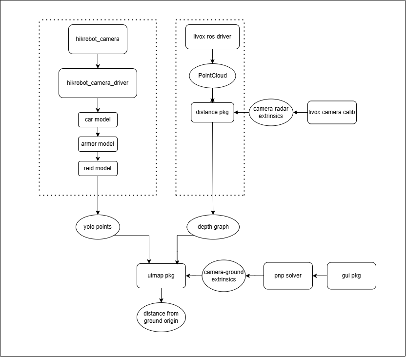

# radar_stationRMUC2024
Solution for the radar station of HKU Astar & Robomaster for Season 2024
## Project Structure



## Dependencies
ros1: noetic  
cuda: 11.8  
TensorRT: 10.1.23  
livox_camera_calib: https://github.com/hku-mars/livox_camera_calib  
livox_ros_driver: https://github.com/Livox-SDK/livox_ros_driver
## How to run  

```
roslaunch custom_msgs launcher.launch
```
## Contributing

Pull requests are welcome. For major changes, please open an issue first
to discuss what you would like to change.

Please make sure to update tests as appropriate.